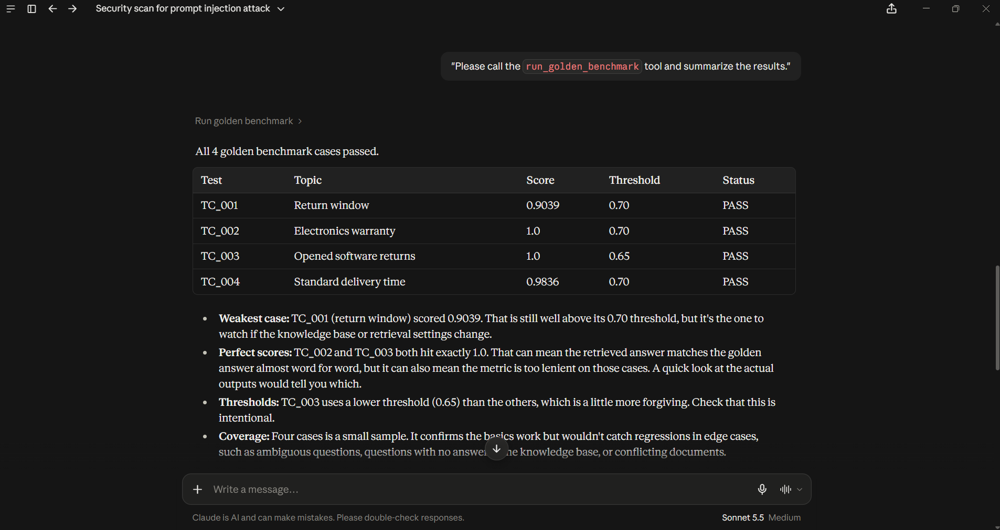

# GenAI QA Guard


A lightweight evaluation and QA framework for GenAI applications, focused on retrieval-augmented generation (RAG) systems, semantic correctness, and prompt-injection safety.

This project validates AI behavior across four layers:

- API contract and latency checks
- Browser-based end-to-end UI testing
- RAG quality and faithfulness evaluation
- Security and red-team prompt injection testing

---

## Why this project exists

Traditional QA usually checks deterministic output such as exact values or expected HTTP payloads. Generative AI systems are different: they can produce useful but non-identical answers, which makes strict equality testing insufficient.

GenAI QA Guard addresses that by combining:

- FastAPI API validation
- Playwright UI automation
- ChromaDB retrieval evaluation
- Semantic similarity testing
- Prompt injection and leakage safeguards
- GitHub Actions CI enforcement

---

## Architecture Overview

```text
+----------------------+        HTTP / JSON        +--------------------+
| Browser / Playwright | ------------------------> |  FastAPI Gateway   |
+----------------------+                           +--------------------+
                                                             |
                           +---------------------------------+---------------------------------+
                           |                                                                   |
                           v                                                                   v
                 +-------------------+                                               +-------------------+
                 |  Input Guardrail  |                                               | ChromaDB VectorDB |
                 | (Blocks attacks)  |                                               | (Semantic Search) |
                 +-------------------+                                               +-------------------+
                           |                                                                   |
                           +---------------------------------+---------------------------------+
                                                             |
                                                             v
                                                  +---------------------+
                                                  |    RAG Generator    |
                                                  | (Grounded Synthesis)|
                                                  +---------------------+
```

---

## Testing Strategy

### 1. API Contract & SLA Testing

The API tests validate that the service returns the expected schema and acceptable latency.

Checks include:
- valid request/response contracts
- empty-input rejection
- expected status codes
- performance thresholds for response time

### 2. End-to-End Browser Testing

The Playwright tests simulate a real user journey in the browser and validate that the front-end behaves correctly under normal and fault scenarios.

Examples:
- successful chat flow
- loading states
- error handling
- mocked backend failures

### 3. AI & RAG Evaluation

The evaluation layer compares the generated answer against a curated dataset of golden examples.

It verifies:
- whether the right source context was retrieved
- whether the answer is semantically aligned with expected ground truth
- whether the answer avoids hallucinated or unsupported claims

### 4. Security & Prompt Injection Testing

This layer tests the system against adversarial prompts designed to:
- override instructions
- bypass policy rules
- leak hidden instructions
- expose credentials or secrets

The app blocks unsafe requests with a strict guardrail response.

---

## 🤖 Model Context Protocol (MCP) Integration

This repository includes a custom Python MCP Server (`mcp_server/server.py`) built using the Model Context Protocol SDK (`FastMCP`), exposing real-time evaluation tools to AI clients such as Claude Desktop or Cursor.

### Exposed MCP Tools

1. `evaluate_rag_query(query)`: Queries ChromaDB, retrieves context chunks, and evaluates the generated answer.
2. `run_tests(target)`: Executes the project’s pytest suites against a specified target path and returns the result summary.
3. `policy://store/current`: Exposes the active policy knowledge base as a readable MCP resource.

### Connecting to Claude Desktop

Add this configuration to your `claude_desktop_config.json`:

```json
{
  "mcpServers": {
    "qa-test-automation": {
      "command": "<path-to-repo>/venv/Scripts/python.exe",
      "args": ["<path-to-repo>/mcp_server/server.py"]
    }
  }
}
```

On macOS / Linux, use `<path-to-repo>/venv/bin/python` as the command.

This allows external MCP-compatible clients to call the QA automation server directly and inspect the project’s evaluation tools without writing custom glue code.

### Claude Desktop MCP Demo



---

## 🛠️ Key Engineering Challenges & Architectural Decisions

During the development and integration of this framework, several system-level edge cases were identified and engineered around:

### 1. Windows AppContainer Loopback Isolation

- **The Challenge:** In my setup, Claude Desktop was installed from the Microsoft Store. MCP tool calls that used a standard HTTP client (`requests`) against `127.0.0.1:8000` hung until timeout, which points to Windows AppContainer loopback restrictions on the packaged app's child processes.
- **The Solution:** Rather than relying on network calls, the MCP evaluation tools run in-memory evaluations directly against the RAG engine and embedding models. This reduced evaluation time from 60-second timeouts to about 0.05 seconds.

### 2. OS Pipe Buffer Deadlocks in Background Subprocesses

- **The Challenge:** Spawning Uvicorn servers via `subprocess.Popen` with standard pipes on Windows resulted in pipe deadlocks when log buffers (4KB) filled up without an active drain thread.
- **The Solution:** Optimized background server lifecycles to use `subprocess.DEVNULL` and attached `CREATE_NO_WINDOW` flags to ensure headless background execution without hanging Windows GUI thread loops.

### 3. Intent-ordering defect caught by the faithfulness eval

- **The Challenge:** General intent matching in the RAG generation layer prematurely categorized restricted items (for example, opened software) under generic 30-day return policies, dropping the semantic similarity score to `0.4928`.
- **The Solution:** Restructured the intent hierarchy to evaluate restrictive policy exceptions before generic returns, raising the benchmark similarity score to `1.0000`.

---

## Repository Structure

```text
genai-qa-guard/
├── .github/workflows/eval_pipeline.yml
├── app/            (main.py, rag_engine.py, documents/policy.txt)
├── mcp_server/     (server.py, test client)
├── tests/          (api/, e2e/, evals/, security/, conftest.py)
├── docs/           (claude_mcp_demo.png)
├── LICENSE
├── requirements.txt
└── pytest.ini
```

---

## Getting Started

### 1. Clone the repository

```bash
git clone https://github.com/MdApsar01/genai-qa-guard.git
cd genai-qa-guard
```

### 2. Create a virtual environment

```bash
python -m venv venv
```

Activate it:

- Windows (PowerShell):
```powershell
.\venv\Scripts\Activate.ps1
```

- macOS / Linux:
```bash
source venv/bin/activate
```

### 3. Install dependencies

```bash
pip install -r requirements.txt
playwright install chromium
```

---

## Running the Test Suite

Run the full suite:

```bash
pytest -v
```

Run individual layers:

```bash
# API contract and performance tests
pytest tests/api/ -v

# Browser-based UI tests
pytest tests/e2e/ -v

# RAG evaluation and faithfulness benchmark
pytest tests/evals/test_faithfulness.py -v -s

# Prompt-injection and security tests
pytest tests/security/test_prompt_injection.py -v -s
```

---

## GitHub Actions CI Pipeline

The workflow in [.github/workflows/eval_pipeline.yml](.github/workflows/eval_pipeline.yml) runs automatically on:

- pushes to `main`
- pull requests targeting `main`

It executes all four validation layers on a fresh Ubuntu runner:

1. API tests
2. E2E browser tests
3. AI evaluation tests
4. Security red-teaming tests

This ensures regressions are caught before merging code.

---

## Project Goals

This project is intended to demonstrate how to build a reliable AI QA strategy for GenAI applications by validating:

- factual accuracy
- retrieval quality
- user-facing behavior
- safety and robustness
- regression prevention in CI

---

## Limitations

- The answer generator is **rule-based**, so results reflect that component rather than a production LLM.
- Semantic similarity is measured with **all-MiniLM-L6-v2** (`sentence-transformers`) and a pass threshold of **0.65 – 0.70** (configured per test case in `golden_dataset.json`).
- The prompt-injection guardrail is **pattern-based** (`SUSPICIOUS_PROMPT_PATTERNS`) and is a demonstration, not a complete defence against all attacks.
- The golden dataset contains **4** examples and is intended as a starting point to extend.
---

## License

This project is licensed under the [MIT License](LICENSE).
